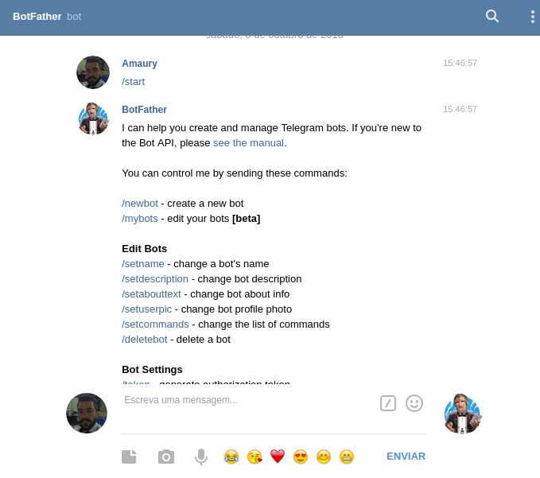
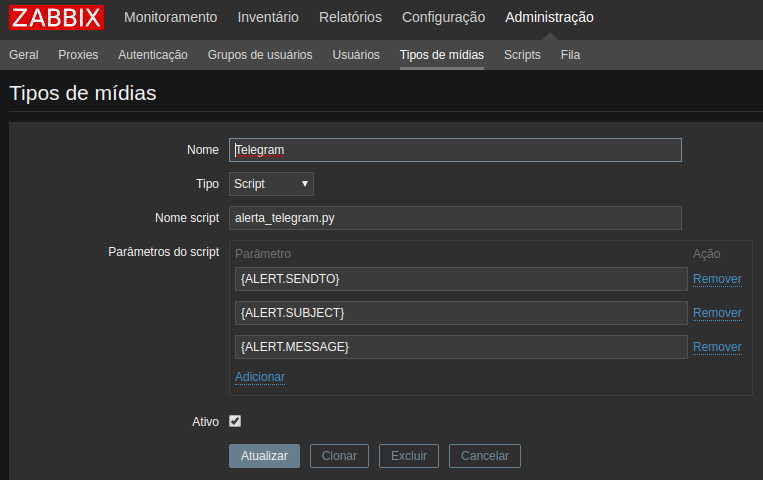
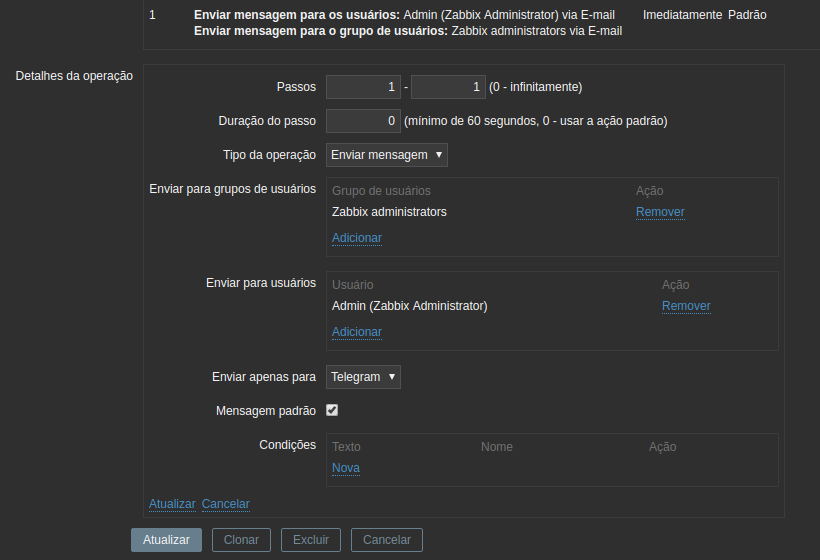

# Notificações do Zabbix com Telegram

### Nessa parte inicial, irei mostrar basicamente como enviar alertas do Zabbix para o Telegram.

1° passo: Com o Zabbix já instalado em seu sistema, e com um dos agentes funcionando (no meu caso irei monitorar um agent que está instalado no CentOS).

2° passo: Devemos ter também uma conta criada no Telegram para que seja possível o envio das notificações. Vamos então, criar um bot no Telegram:

Conforme imagem abaixo, você deve procurar pelo bot no Telegram de nome, `BotFather` e selecionar o BotFather para conversar:

Em seguinda, você pode digitar no chat do bot `/start`, que ele mostrará as opções, conforme imagem abaixo:

3º passo: Digitar `/newbot` para a criação do bot no Telegram.

4º passo: Digitar um nome para o bot, exemplo: Curso Zabbix.

5º passo: Digitar um nome de usuário para o bot, que obrigatoriamento deve terminar com `bot`. 
   Exemplo: `alertazbx_bot`
      
6º passo: Feito isso, anotar o token de acesso a API gerada, ela é importante e será utilizada durante o processo de definição da integração com o Zabbix.

7º passo: Instalação das dependências:

   `apt-get install python-pip`
   `pip install pyTelegramBotAPI`
   
8º passo: Nesse passo, você deve acessar seu servidor Zabbix, e procurar pela localização do `AlertScriptPath`

9º passo: O script será adicionado neste diretório, você pode obter esse script aqui: [alerta_telegram](https://github.com/amaurybsouza/Monitoramento-com-Zabbix/blob/master/imagens/alerta_telegram)

10º passo: Dar permissão de execução nesse script: `chmod +x alerta_telegram.py`

11º passo: Pegar o ID do usuário do Telegram, é necessário o ID de usuário par enviar mensagem.

Para pegar o ID, abra o navegador e digite: https://api.telegram.org/bot<INSIRA-O –TOKEN-AQUII>/getUpdates

Teste o envio do alerta para um usuário: ./alerta_telegram.py "166586565" "ALERTA" "Testando."

12º passo: Adicionar mídia do Zabbix:

Menu Admistração -> Tipos de mídias

13º passo: Selecionar o tipo de mídia na ação:

